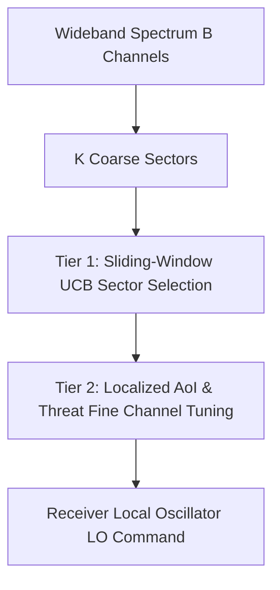

# Phase 8: Advanced Differentiators & Cognitive EW Extensions

## Overview
Phase 8 equips the **DRISHTI** architecture with cognitive Electronic Warfare (EW) and Electronic Protection (EP) differentiators that elevate the platform beyond conventional fixed scheduling or baseline heuristics:

1. **Adversarial Cognitive Radar (`AdversarialEvasionEmitter`)**: An intelligent cognitive radar that models the ES receiver's revisit distribution and uses min-max evasion hopping to avoid interception.
2. **Out-of-Distribution (OOD) Novelty Detector (`NoveltyDetector`)**: A regularized Mahalanobis distance metric space evaluator identifying uncataloged waveforms and novel electronic attack techniques with natural-language feature attribution.
3. **Hierarchical Coarse-to-Fine Scheduler (`HierarchicalScanScheduler`)**: A two-tier scheduler partitioning wideband spectrum ($B$ channels) into sub-octave sectors, executing macro-sector exploration via Sliding-Window UCB and micro-channel exploitation via localized Age-of-Information (AoI).

---

## 1. Adversarial Cognitive Evasion Radar

### Theoretical Formulation
Hostile cognitive radars do not emit on static schedules. The `AdversarialEvasionEmitter` implements an adaptive Electronic Protection (EP) loop:
$$\hat{p}_{\text{rec}}(b) = \frac{1}{W} \sum_{\tau=t-W}^{t-1} \mathbb{I}(a_\tau = b), \quad \forall b \in \mathcal{B}_{\text{hop}}$$

The adversary selects its next emission carrier by minimizing the probability of receiver interception:
$$b^*_t = \arg\min_{b \in \mathcal{B}_{\text{hop}}} \hat{p}_{\text{rec}}(b)$$
With probability $\epsilon_{\text{explore}} = 1 - \gamma_{\text{greediness}}$, the emitter executes uniform stochastic exploration across $\mathcal{B}_{\text{hop}}$ to avoid deterministic counter-exploitation.

---

## 2. OOD Waveform Novelty Detection

### Mahalanobis Distance Metric
Incoming intercepted pulse trains are mapped to 4D tactical feature space:
$$\mathbf{x} = \big[ T_{\text{period}},\ \delta_{\text{duty}},\ P_{\text{dBm}},\ N_{\text{hop}} \big]^T$$

Against a pre-mission verified threat library $\mathcal{D}_{\text{ref}} \sim \mathcal{N}(\boldsymbol{\mu}, \mathbf{\Sigma})$, the Mahalanobis distance is computed:
$$D_M(\mathbf{x}) = \sqrt{ (\mathbf{x} - \boldsymbol{\mu})^T \mathbf{\Sigma}_{\text{reg}}^{-1} (\mathbf{x} - \boldsymbol{\mu}) }$$
where $\mathbf{\Sigma}_{\text{reg}} = \mathbf{\Sigma} + 10^{-4}\mathbf{I}_4$.

- If $D_M(\mathbf{x}) \ge \tau_{\text{novel}}$ (default $\tau = 3.0\sigma$), the signal is flagged as an **unprecedented or novel hostile radar mode**.
- The system produces an instant natural-language explainability breakdown ranking feature $z$-scores:
  $$z_j = \frac{|x_j - \mu_j|}{\sigma_j}$$

---

## 3. Two-Tier Hierarchical Scan Scheduling

### Architecture
Wideband ES receivers often monitor bandwidths spanning dozens or hundreds of channels where full-spectrum fine scanning introduces excessive switching latency. The `HierarchicalScanScheduler` structures the decision space hierarchically:

1. **Tier 1 (Macro Sector)**: Selects active sub-octave sector $s \in \{0, \dots, K-1\}$ via `SlidingWindowUCB` monitoring sector-aggregated Age-of-Information and intercept yield.
2. **Tier 2 (Micro Channel)**: Selects specific sub-band $b \in \mathcal{B}_s$ optimizing:
   $$\text{Score}(b) = (1 + \tau_b) \cdot w_b^{\text{prior}}$$

---

## 4. Verification & Unit Testing

The Phase 8 test suite in `tests/test_phase8.py` verifies all differentiators:
- `test_adversarial_evasion_emitter_evades_receiver`: Proves adversary successfully diverts carrier to unmonitored channels when the ES receiver concentrates on specific bands.
- `test_novelty_detector_mahalanobis`: Validates that nominal radar signatures evaluate to $D_M < 3.0\sigma$ while anomalous waveform parameters trigger high $D_M > 3.0\sigma$ and generate diagnostic alerts.
- `test_hierarchical_scan_scheduler_simulation_loop`: Validates end-to-end gym interaction, coarse bandit reward propagation, and explainability payload generation.
